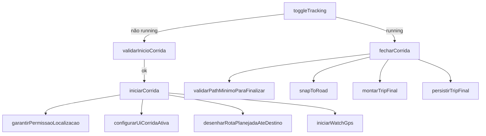

# Fase 2 — Clean Code & Patterns (L.A. Controle de Frota)

Material de estudo do app **L.A. Controle de Frota**.  
Objetivo: funções pequenas, uma responsabilidade cada (SRP), e menos duplicação (DRY).

---

## 1. Princípios usados neste projeto

| Princípio | Significado | Exemplo no app |
|-----------|-------------|----------------|
| **SRP** (Single Responsibility) | Cada função faz **uma** coisa | `validarInicioCorrida` só valida; não inicia GPS |
| **DRY** (Don't Repeat Yourself) | Não copiar o mesmo `fetch` em vários lugares | `buscarGeometriaOrs` serve snap + rota planejada |
| **Nomes que revelam intenção** | Ler o nome e entender o efeito | `podeExecutarSnapAoVivo`, `montarTripFinal` |
| **Orquestração fina** | Função “chefe” só chama passos | `toggleTracking` → `iniciarCorrida` ou `fecharCorrida` |

---

## 2. Camadas lógicas (ainda em um arquivo só)

O app continua em `index.html` (PWA simples), mas o JavaScript está organizado em **blocos mentais**:

```
┌─────────────────────────────────────────┐
│  UI — telas, botões, Leaflet no mapa    │  showScreen, configurarUiCorridaAtiva
├─────────────────────────────────────────┤
│  Domínio — regras de negócio            │  validarInicioCorrida, validarPathMinimo
├─────────────────────────────────────────┤
│  Serviços — APIs e Firebase             │  buscarGeometriaOrs, persistirTripFinal
├─────────────────────────────────────────┤
│  GPS — leitura e filtros de posição     │  onPosicaoGps → processarPontoGpsContinuo
└─────────────────────────────────────────┘
```

Na **Fase 5** (spec-driven) ou em um refactor maior, esses blocos podem virar arquivos `.js` separados. Por ora, os comentários `// ----- Fase 2: ... -----` marcam as seções.

---

## 3. Mapa das funções — ciclo da corrida



**Por que separar?**  
Você consegue ler `fecharCorrida` de cima a baixo como uma receita, sem misturar validação, HTTP e alertas em um único bloco gigante.

---

## 4. Mapa das funções — GPS

| Função | Responsabilidade |
|--------|------------------|
| `iniciarWatchGps` | Registra `watchPosition` e limpa watch anterior |
| `onPosicaoGps` | Porta de entrada: precisão, primeiro ponto vs contínuo |
| `processarPrimeiroPontoGps` | Primeiro fix no mapa |
| `processarPontoGpsContinuo` | Filtros 3 m / 120 m, soma distância, snap ao vivo |
| `publicarPosicaoAtualNoFirebase` | Escreve `last_pos` |
| `tratarErroGps` | Alertas de permissão / indisponível |

---

## 5. Mapa das funções — ORS (map-matching)

| Função | Responsabilidade |
|--------|------------------|
| `pathParaCoordsOrs` / `coordsOrsParaPath` | Conversão de formato |
| `buscarGeometriaOrs` | **Único** `fetch` POST para directions |
| `amostragemPath` | Reduz pontos antes da API (limite/custo) |
| `snapToRoad` | Map-matching do trajeto |
| `podeExecutarSnapAoVivo` | Regras de throttle (14 s, mín. 4 pontos) |
| `aplicarSnapNaPolyline` | Atualiza linha azul no mapa |
| `atualizarTrajetoAoVivoNasRuas` | Orquestra snap durante a corrida |

**Antes:** `snapToRoad` e `desenharRotaPlanejadaAteDestino` repetiam URL, headers e parse do JSON.  
**Depois:** ambos usam `buscarGeometriaOrs`.

---

## 6. Exercício rápido (autoavaliação)

1. O que `toggleTracking` faz se `running === false`?  
2. Onde está a regra “mínimo 2 pontos para finalizar”?  
3. Por que `radiuses: 50` só aparece no snap e não na rota planejada?  
4. Se a ORS falhar no `fecharCorrida`, o que `snapToRoad` devolve?

<details>
<summary>Respostas</summary>

1. Valida destino/motivo → `iniciarCorrida`.  
2. `validarPathMinimoParaFinalizar`.  
3. No snap, cada ponto GPS pode estar longe da rua; `radiuses` diz à API até quantos metros procurar a via. Na rota planejada só há origem e destino já definidos.  
4. O `rawPath` original (fallback seguro).

</details>

---

## 7. Checklist Fase 2

- [ ] Consigo explicar **SRP** com um exemplo do nosso código  
- [ ] Sei a diferença entre **orquestração** (`fecharCorrida`) e **serviço** (`snapToRoad`)  
- [ ] Entendo por que `[lat,lng]` vira `[lng,lat]` na ORS  
- [ ] Sei onde está o throttle do snap ao vivo (`SNAP_AO_VIVO_MS`)

---

## Próximo passo

**Fase 3 — Security** → ver `FASE-3-ESTUDO.md`.

**Fase 4 — Tests** → ver `FASE-4-ESTUDO.md`.
