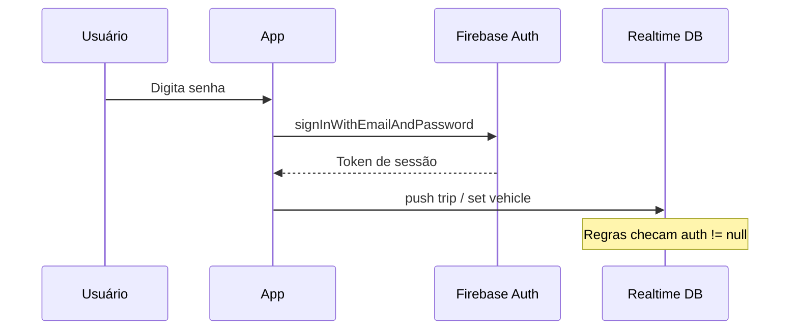

# Fase 3 — Security (L.A. Controle de Frota)

Objetivo: **não guardar segredo no JavaScript** e **bloquear o Firebase** para quem não fez login de verdade.

---

## 1. O que mudou no código

| Antes (inseguro) | Depois (Fase 3) |
|------------------|-----------------|
| Senha fixa no HTML | Senha só no **Firebase Authentication** |
| `localStorage` fingindo sessão | Sessão real: token do **Firebase Auth** |
| Qualquer um com o link lia/escrevia no RTDB* | Regras exigem `auth != null` |

\* Só depois de você **publicar** `database.rules.json` no Console (passo 2).

Arquivos novos:
- `la-firebase.js` — login, logout, observador de sessão
- `database.rules.json` — regras para colar/publicar no Firebase

---

## 2. Passo a passo no Firebase Console (obrigatório)

### Passo 1 — Ativar login por e-mail

1. [Firebase Console](https://console.firebase.google.com/) → projeto **la-controle**
2. **Authentication** → **Sign-in method** → **E-mail/senha** → **Ativar**

### Passo 2 — Criar usuário de teste (um só, universal)

**Users** → **Add user** → cadastre **uma vez**:

| Campo | Valor |
|-------|--------|
| E-mail | `admin@lacustom.test` |
| Senha | A que **você** definir no Console (não documentar em arquivos do projeto) |

- **Não é e-mail real** — domínio `.test` só para desenvolvimento.
- O Firebase **não aceita** login com texto `admin` sem `@`; por isso usamos `admin@lacustom.test`.
- **App motorista e painel** usam a mesma conta: na tela você digita só a senha cadastrada no Console.

Para produção depois, crie `frota@...` e `gestao@...` separados e edite `LA_AUTH_EMAIL` em `la-firebase.js`.

### Passo 3 — Publicar regras do Realtime Database

1. **Realtime Database** → aba **Regras**
2. Cole o conteúdo de `database.rules.json`:

```json
{
  "rules": {
    ".read": "auth != null",
    ".write": "auth != null"
  }
}
```

3. **Publicar**

**Ordem importante:** crie os usuários **antes** de publicar regras restritas, senão o app para de gravar viagens até alguém logar.

### Passo 4 — Testar

1. Abra o app → digite a senha cadastrada no Firebase
2. Inicie e finalize uma corrida de teste
3. Abra o painel → mesma conta de teste (`admin@lacustom.test`)
4. Veja se a viagem aparece no histórico

---

## 3. O que ainda fica exposto (e por quê)

| Item | Risco | Mitigação futura |
|------|--------|------------------|
| `apiKey` do Firebase | Normal no front; segurança vem das **regras** + Auth | Regras publicadas |
| `ORS_KEY` | Fica em `la-config.js` (não vai pro Git) | Secret `ORS_KEY` no GitHub Actions ou proxy no backend |
| Código-fonte no GitHub Pages | Público | Auth + regras impedem abuso do **banco** |

A `apiKey` **não é** senha do banco — é identificador do app. Quem não tem login válido não deve ler/escrever dados com as regras corretas.

---

## 4. Fluxo de autenticação



---

## 5. Funções em `la-firebase.js`

| Função | Papel |
|--------|--------|
| `laEntrar('motorista', senha)` | Login do app |
| `laEntrar('painel', senha)` | Login do painel |
| `laSair()` | Logout |
| `laObservarAuth(onLogado, onDeslogado)` | Mantém tela certa ao abrir/recarregar |
| `laMensagemErroAuth(err)` | Mensagens em português |

---

## 6. Checklist Fase 3

- [ ] E-mail/senha ativado no Firebase Authentication
- [ ] Usuário de teste `admin@lacustom.test` criado no Console
- [ ] Regras `auth != null` publicadas
- [ ] App motorista loga e salva viagem
- [ ] Painel loga e lista viagens
- [ ] `la-config.js` criado localmente (copiar de `la-config.example.js`)
- [ ] Entendo que `ORS_KEY` no site ainda é visível no navegador (limite de PWA estática)

---

## Próximo passo

**Fase 4 — Tests** → ver `FASE-4-ESTUDO.md`.

**Fase 5 — Spec-driven** (próxima na trilha).
